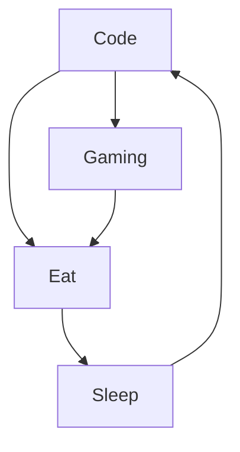

# Thanos Code 

  
  

  

Je suis Emmanuel, développeur web et web mobile. J'habite en France dans le département de la Seine-et-Marne dans le 77. J'apprends récemment Flutter pour le mobile avec JS et React pour le front-end, Python pour la partie back-end avec Django.  💻 

<!--
-->
   
## 🛠️ Languages & Tools

  
 
 
 
 
 
 
 
 
 
 
 

### :fire: Recent Github Activity
<!--START_SECTION:activity-->
1. 🎉 Merged PR [#10](https://github.com/Thanos974/BKT-KITE-TEAM/pull/10) in [Thanos974/BKT-KITE-TEAM](https://github.com/Thanos974/BKT-KITE-TEAM)
2. 💪 Opened PR [#10](https://github.com/Thanos974/BKT-KITE-TEAM/pull/10) in [Thanos974/BKT-KITE-TEAM](https://github.com/Thanos974/BKT-KITE-TEAM)
3. 🎉 Merged PR [#9](https://github.com/Thanos974/BKT-KITE-TEAM/pull/9) in [Thanos974/BKT-KITE-TEAM](https://github.com/Thanos974/BKT-KITE-TEAM)
4. 💪 Opened PR [#9](https://github.com/Thanos974/BKT-KITE-TEAM/pull/9) in [Thanos974/BKT-KITE-TEAM](https://github.com/Thanos974/BKT-KITE-TEAM)
<!--END_SECTION:activity-->

### :zap: My daily routine :

### :writing_hand: Connect with me:

### :bar_chart: Github Stats 

<a href="https://github.com/Thanos974/Thanos974">
 
 
 

 
  Visitor count 
  

